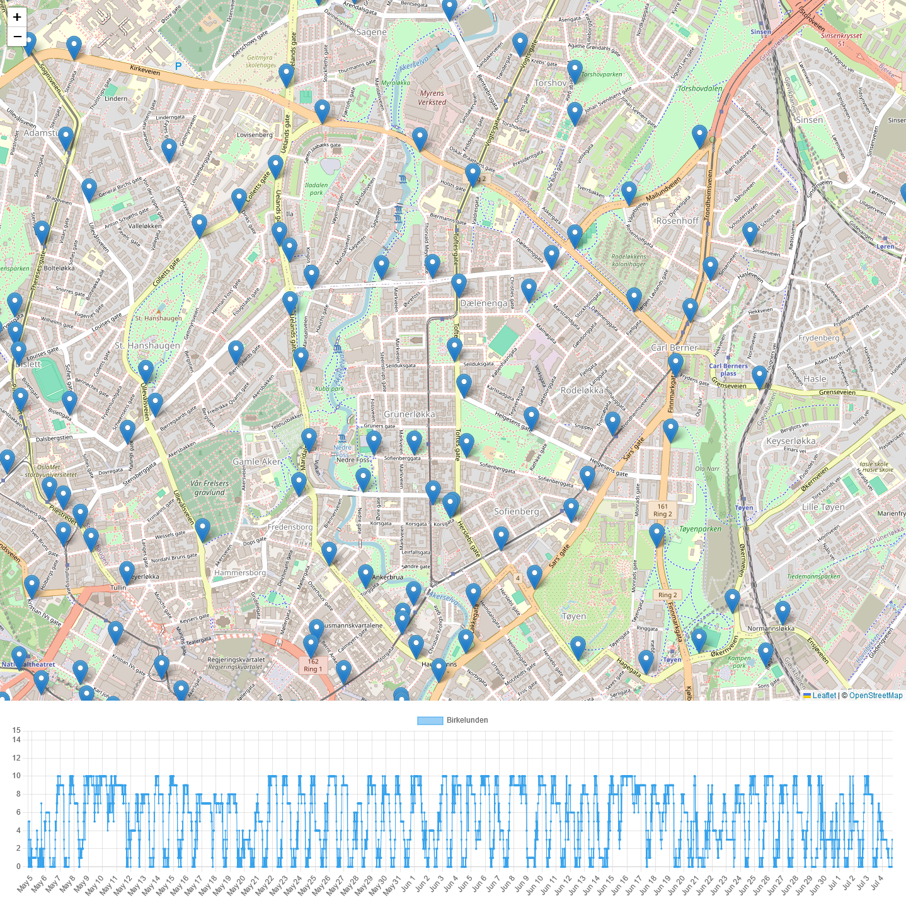

# Shitty bike

[Oslo City Bike](https://oslobysykkel.no/en) is a convenient way to rent a bike for a short while.

It's great.

But.

It's also shit, sometimes.

* Sometimes bikes are broken.
* Sometimes when you want a bike, all the stations are empty.
* Sometimes when you want to deliver a bike, all the stations are full.

If you only could view this data on some kind of map, with some kind of graph...

Well. Now you can! With this low effort/work in progress thing.

```bash
mkdir data
bash get_data.sh
# Get some data for a while
gunzip ./data/*.gz
python parse_data.py data > ./web/data.json
python3 -m http.server -d web
```

View your data in a browser.


